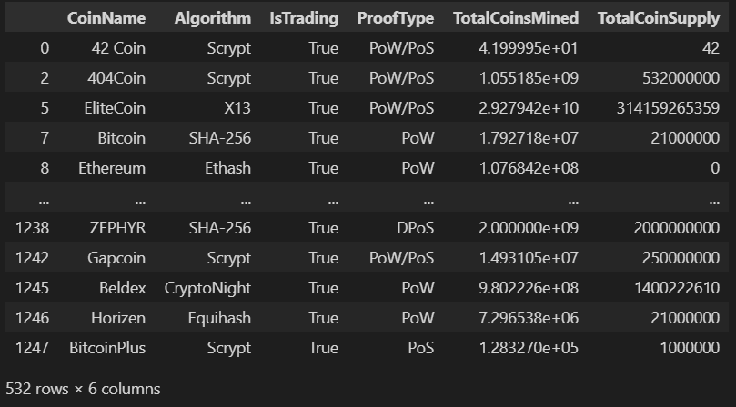
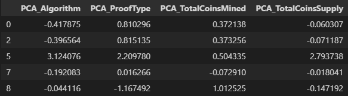
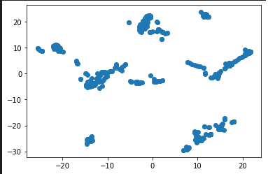
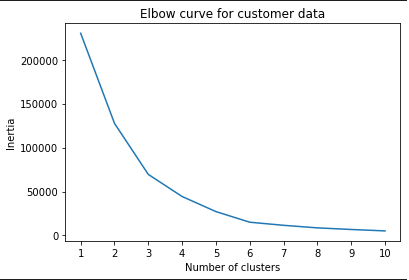
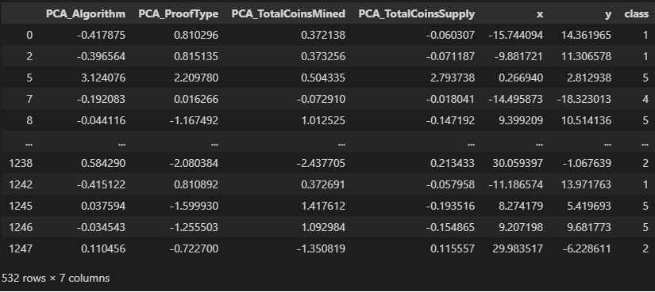
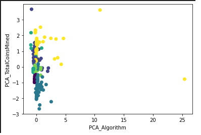
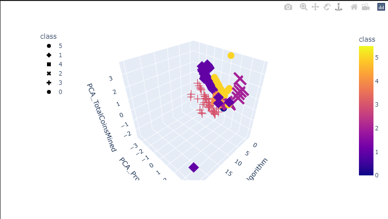

# MACHINE LEARNING - UNSUPERVISED ASSIGNMENT - Cryptocurrency Clusters

## Background
* You are on the Advisory Services Team of a financial consultancy. One of your clients, a prominent investment bank, is interested in offering a new cryptocurrency investment portfolio for its customers. The company, however, is lost in the vast universe of cryptocurrencies. They’ve asked you to create a report that includes what cryptocurrencies are on the trading market and determine whether they can be grouped to create a classification system for this new investment.

* You have been handed raw data, so you will first need to process it to fit the machine learning models. Since there is no known classification system, you will need to use unsupervised learning. You will use several clustering algorithms to explore whether the cryptocurrencies can be grouped together with other similar cryptocurrencies. You will use data visualization to share your findings with the investment bank.

## Approach
We will be using Unsupervised Learning concepts to try and answer the problems and arive at an conclusion whether the clusters created from the unclassified data can help the clients group their newly planned cryptocurrency with its own group.

We have tried to solve this problem using the following steps:

### Step 1: Data Preparation
* Input file: `crypto_data.csv`
* The input file was read using `PANDAS`
* Filtered the input dataframe to showcase the cryptocurrenies which are being traded `'IsTrading' = True`
* Droped any row which had null values from the dataframe
* Filtered on the cryptocurrency that had total coins mined greater than zero `TotalCoinsMined > 0`
* Removed the columns `CoinName` and `IsTrading` columns

* Used skLearn's `LabelEncoder` to create dummy variables/encodes for the `Algorithm` and `ProofType` columns
  * Used this approach instead of get_dummies() for simplification
  

* Used skLearn's `StandardScalar` to standardize the data

* This completes all the Data preparation activities

### Step 2: Dimensionality Reduction
* Performed dimensionality reduction using PCA
* Dataset dimensions were further reduced with t-SNE

* Using plotly scatter plot we tried to vizualize the clusters of data

* Based on the scatter plot we can identified multiple clusters of cryptocurrency visible
* This concludes of Dimensionality Reduction, where we reduced redudant data and maintaining data with variation

### Step 3: Cluster Analysis using k-Means
* We determined the `k` and `Inertia` values
* The elbow curve was plotted to identify the best candidate for k

* Based on the elbow curve i can see that at k = 6, the change has started to more consistant in nature
* `k` = 6 will be used as value of k i.e. a total of 6 classes will be created
* Following is the cluster data frame

* Following is the scatter plot of the clusters based on `Algorithm` and `TotalCoinsMined` PCA values 

* Finally created the 3D Scatter plot to show the various classes of Cryptocurrency

* This completes our Cluster Analysis

## Conclusion
Based on the cluster Analysis, I reached at the following conclusion
* The clustering would be beneficial for this example based on the data provided by the clients.
* After using the concepts of Dimension Reduction and Cluster Analysis, an elbow curve was created to identify a valid "k" value for the cluster. I determined based on the Elbow curve, k = 6 (6 clusters) would be the most effective
* Using PCA and t-SNE technicique for dimesnion reduction we were able to successfully identify the right amount of clusters
* Based on the 3D Scatter plot, we can assume that 2 cryptocurrencies "Komodo" and "BitTorrent" can be excluded from the dataset to acheive a better cluster. They may potentially be incorrect data or out of scale

